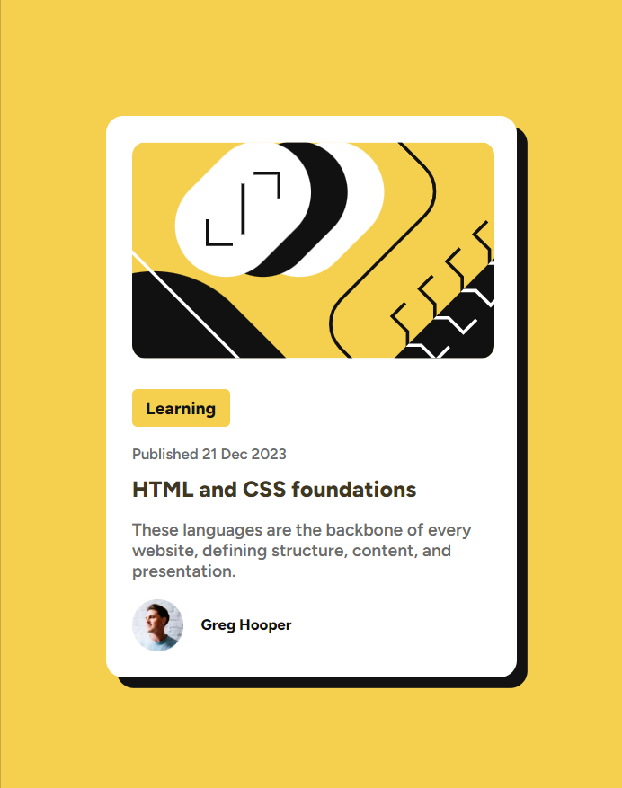

# Frontend Mentor - Blog preview card solution

This is a solution to the [Blog preview card challenge on Frontend Mentor](https://www.frontendmentor.io/challenges/blog-preview-card-ckPaj01IcS). Frontend Mentor challenges help you improve your coding skills by building realistic projects. 

## Table of contents

- [Overview](#overview)
  - [Screenshot](#screenshot)
  - [Links](#links)
- [My process](#my-process)
  - [Built with](#built-with)
  - [What I learned](#what-i-learned)
  - [Continued development](#continued-development)
  - [Useful resources](#useful-resources)
- [Author](#author)
- [Acknowledgments](#acknowledgments)


## Overview

### Screenshot



### Links

- Solution URL: [On my Github](https://github.com/mancsedmon29/Blog-Preview)
- Live Site URL: [QR Code Component]()

## My process

### Built with

- Semantic HTML5 markup
- CSS custom properties
- CSS Grid

### What I learned

In this challenge, I learned how to structure the layout by separating elements using the `<div>` tag and assigning them appropriate class names. Specifically, I wrapped elements inside a `.container` and divided them into `.card` and `.text` sections to maintain a clean structure.

Here’s my HTML structure:


```html
  <div class="container">
    <div class="card">
      
      <div class="content">
        <p class="category">Learning</p>
        <p class="meta">Published 21 Dec 2023</p>
        <h1>HTML and CSS foundations</h1>
        <p>These languages are the backbone of every website, defining structure, content, and presentation.</p>
      </div>
      <div class="author">
        
        <p class="author-name">Greg Hooper</p>
      </div>
    </div>
  </div>
```
When working with **HTML structure**, wrapping and dividing content using <div> tags is crucial. However, **styling it with CSS** can be more challenging, especially when centering the card and making it responsive using **Grid**.

One of the key challenges was using **CSS Grid** to align the card in the center and ensuring the layout remains responsive when the page shrinks. Here’s my **CSS solution**:
```css
/* Styled by "Edmon Mancao" */
@import url('https://fonts.googleapis.com/css2?family=Figtree:ital,wght@0,300..900;1,300..900&display=swap');

:root {
    --Yellow: hsl(47, 88%, 63%);
    --White: hsl(0, 0%, 100%);
    --Gray: hsl(0, 0%, 42%);
    --Black: hsl(0, 0%, 7%);
    --fonts: 'Figtree', sans-serif;
    --fs-main: 16px;
    --fw-600: 600;
    --fw-800: 800;
}

body {
    margin: 0;
    padding: 0;
    box-sizing: border-box;
    font-family: var(--fonts);
    background-color: var(--Yellow);
    font-weight: var(--fw-600);
    color: var(--Gray500);
}

h1 {
    line-height: 1.1;
    color: var(--Black);
    font-weight: var(--fw-800);
    font-size: 1.3rem;
    cursor: pointer;
    transition: color .3s ease;
}

h1:hover {
    color: var(--Yellow);
}

.container {
    display: grid;
    place-items: center;
    min-height: 100vh;
}

.card {
    background-color: var(--White);
    padding: 1.5rem;
    max-width: 333px;
    border-radius: 1rem;
    box-shadow: 6px 6px 0 var(--Black);
    transition: box-shadow .3s ease;
    /* positioning */
    margin: 0 1rem;
}

.card:hover {
    box-shadow: 10px 10px 0 var(--Black);
}

.card img {
    border-radius: .8rem;
    margin-bottom: 0;
}

.card > * + * {
    margin-top: .5rem;
}


.content p {
    color: var(--Gray);
}

.category {
    display: inline-block;
    background-color: var(--Yellow);
    padding: .5rem .8rem;
    font-weight: var(--fw-800);
    color: var(--Black) !important;
    border-radius: .3rem;
}

.meta {
    margin-top: 0;
    font-size: 14px;
    color: var(--Black);
}

.author {
    display: flex;
    gap: 1rem;
    align-items: center;
}

.author img {
    width: 3rem;
}

.author .author-name {
    color: var(--Black);
    font-size: 14px;
    font-weight: var(--fw-800);
}
```

Overall, this challenge helped me understand **structuring HTML properly** and **using CSS Grid** to achieve a centered, responsive design. I wanted to share my experience here to help others working on similar projects. 🚀


### Continued development

Here, in this group. I want to learn more when it comes of development.

### Useful resources

- [CSS Grid 20 Mins](https://www.youtube.com/watch?v=9zBsdzdE4sM) - This helped me to know more about Grid in web development world.


## Author

- Frontend Mentor - [@mancsedmon29](https://www.frontendmentor.io/profile/mancsedmon29)
- LinkedIn - [@Edmon Mancao](https://www.linkedin.com/in/edmon-mancao-789093228/)


## Acknowledgments

I would like to express my gratitude to **Frontend Mentor** for providing this challenge, which helped me enhance my front-end development skills. This project allowed me to practice structuring HTML elements, implementing CSS grid for alignment, and improving responsiveness.

Additionally, I appreciate the **support from online coding resources** and tutorials that guided me in refining my CSS styling techniques. This project has been a great learning experience, and I look forward to building more projects to improve my skills.
